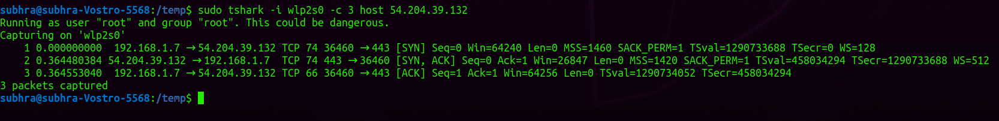
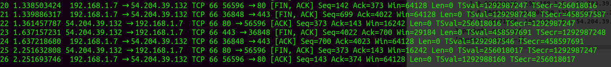
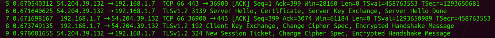

## View active network interface
### ifconfig
The “ifconfig” command with no arguments will display all the active interfaces details. The ifconfig command also used to check the assigned IP address of an server.

## View all network interface
### ifconfig -a
The ifconfig command with -a argument will display information of all active or inactive network interfaces on server. 

## View a specific network interface
### ifconfig < interface name >
eg: ```ifconfig wlp2s0```

## Get your public IP
### wget -qO- ifconfig.me

## Monitor packets on a network interface
### sudo tshark -i < interface name >
eg: ```sudo tshark -i wlp2s0```

## Install bind-utils
```sudo apt install bind9-utils```

## See your nameserver
```cat /etc/resolv.conf```

## nslookup
### nslookup < domin >
eg: ```nslookup textsummarizer.subhrapaladhi.com```

## Question: 
Q. why is IP 224.0.0.251 trying to connect to me when I log into my gmail?
A. 224.anything and 192.anything are devices or apps on your local network (home/school/work). 192.anything especially is another device on that same network. The other ones included a 192.* type, which I've already described.
The FF02::FB is probably a portion of an IPv6 ip address. 224.* is a multicast "domain", wherein various apps will use it to connect to other apps etc.


## TCP Handshake

public ip of Opensource.com: 54.204.39.132

You can view the three packets below. The first packet sends a SYN request from my laptop to the Opensource.com server. The second packet is the Opensource.com server replying with a SYN, ACK flag set. Finally, the third packet is my laptop sending an ACK request to acknowledge receiving the second packet. This is called a TCP handshake. After this handshake, both nodes (i.e., my laptop and the Opensource.com server) can exchange data.

## TCP Close Connection

This time FIN, ACK packet to Opensource.com (in packet 1 below), followed by a FIN, ACK from Opensource.com to my laptop (in packet 2 below), and finally an ACK packet sent by my laptop to the Opensource.com server. This concludes the network connection that was established earlier, and any future connections will have to set up a TCP handshake again.

## Encrypt handshake

The TCP handshake concludes in the first three packets, and the fourth to the ninth have various packets that have TLS strings, which follow a similar handshake ritual to set up a secure, encrypted connection between the two hosts

## View the Entire Packet
### sudo tshark -i < network interface > -V